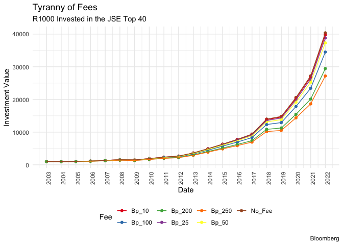

# Approach

-   management fees are constructed as ad valorem fee and overtime will
    have a compounding effect just like returns when they compound
    overtime.

## notes

-   since fees compound i tried apply the fees towards the investment
    amount at the end of the year. the fee should also compound because
    its growing at a constant on an increasing base year over year.

-   the effect of the feee should be deducted every year from the year
    investment amount.

-   so whatever value we have for the portfolio we deduct the relevant
    fee for that period.

-   to get the compounding effect yoy I have to get the index referring
    to the year in which the total return applies. So day we are in 2002
    and that the start of the index, i can depict that as investmnet
    horizon year zero. the rest will be straight forward.

-   this works because annualized return is the yearly depiction of
    compounding return

-   be careful to take measures that will not break the chain in
    returns, Nico uses coalesce to replace any NAs with Zeros.

-   so get annualized return for the actual investment and deduct the
    net fees from that. and a compoundnig period column

``` r
rm(list = ls()) # Clean your environment:
gc() # garbage collection - It can be useful to call gc after a large object has been removed, as this may prompt R to return memory to the operating system.
```

    ##          used (Mb) gc trigger (Mb) limit (Mb) max used (Mb)
    ## Ncells 468197 25.1    1003000 53.6         NA   669411 35.8
    ## Vcells 875878  6.7    8388608 64.0      16384  1851710 14.2

``` r
library(tidyverse)
```

    ## ── Attaching core tidyverse packages ──────────────────────── tidyverse 2.0.0 ──
    ## ✔ dplyr     1.1.2     ✔ readr     2.1.4
    ## ✔ forcats   1.0.0     ✔ stringr   1.5.0
    ## ✔ ggplot2   3.4.2     ✔ tibble    3.2.1
    ## ✔ lubridate 1.9.2     ✔ tidyr     1.3.0
    ## ✔ purrr     1.0.1     
    ## ── Conflicts ────────────────────────────────────────── tidyverse_conflicts() ──
    ## ✖ dplyr::filter() masks stats::filter()
    ## ✖ dplyr::lag()    masks stats::lag()
    ## ℹ Use the conflicted package (<http://conflicted.r-lib.org/>) to force all conflicts to become errors

``` r
list.files('code/', full.names = T, recursive = T) %>% .[grepl('.R', .)] %>% as.list() %>% walk(~source(.))
library(lubridate)

data <- fmxdat::Jalshtr
```

``` r
#  calculate annualized returns
com.rets <- data %>% 
  arrange(date) %>% 
  mutate(Year = format(date, "%Y")) %>% 
  mutate(ret = TRI / lag(TRI) - 1) %>% 
  filter(date > first(date)) %>%
  mutate(com.ret = cumprod(1 + ret)) %>% 
  group_by(Year) %>% 
  filter(date == last(date)) %>% 
  ungroup()

#  now to get annualized returns
ann.ret <- com.rets %>%
  mutate(Year = format(date, "%Y"),
         Year = as.Date(paste0(Year, "-12-31"))) %>%
  group_by(Year) %>%
  summarise(Annual.ret = com.ret^(1/12) - 1)

#  add another column for compounding period
ann.ret <- ann.ret %>%
  mutate(horizon = as.numeric(difftime(Year, as.Date("2002-12-31"), units = "days")) / 365,
         horizon = round(horizon))

# include fees
fee_impact <- function(investment, fee, annual.return, horizon) {
  fee <- fee / 10000  # Convert basis points  to decimal form
  final_portfolio_with_fees <- investment * (1 + annual.return - fee) ^ horizon
  final_portfolio_with_fees
}

fee.difference <- function(df, bp){
  new.df <- df %>% 
    mutate(bp_1 = fee_impact(1000, bp, ann.ret$Annual.ret, ann.ret$horizon))
  new.df
}

# put all of them into a single dataframe 
no_fee <- fee_impact(investment = 1000, fee = 0, annual.return = ann.ret$Annual.ret, horizon = ann.ret$horizon)
fee_10 <- fee_impact(investment = 1000, fee = 10, annual.return = ann.ret$Annual.ret, horizon = ann.ret$horizon)
fee_25 <- fee_impact(investment = 1000, fee = 25, annual.return = ann.ret$Annual.ret, horizon = ann.ret$horizon)
fee_50 <- fee_impact(investment = 1000, fee = 50, annual.return = ann.ret$Annual.ret, horizon = ann.ret$horizon)
fee_100 <- fee_impact(investment = 1000, fee = 100, annual.return = ann.ret$Annual.ret, horizon = ann.ret$horizon)
fee_250 <- fee_impact(investment = 1000, fee = 250, annual.return = ann.ret$Annual.ret, horizon = ann.ret$horizon)
fee_200 <- fee_impact(investment = 1000, fee = 200, annual.return = ann.ret$Annual.ret, horizon = ann.ret$horizon)  

tyranny <- data.frame(
  No_Fee = no_fee,
  Bp_10 = fee_10,
  Bp_25 = fee_25,
  Bp_50 = fee_50,
  Bp_100 = fee_100,
  Bp_250 = fee_250,
  Bp_200 = fee_200  
)

tyranny$Date <- ann.ret$Year

# Make the data tidy
tidy.tyranny <- tyranny %>% 
  gather(Fee, Investment, -Date)

tidy.tyranny$Date <- as.Date(tidy.tyranny$Date)

# Plot the line graph

ggplot(tidy.tyranny, aes(x = Date, y = Investment, color = Fee, group = Fee)) +
  geom_point(size = 1.5) +      
  geom_line(size = 0.5) +         
  labs(title = "Tyranny of Fees", 
    subtitle = "R1000 Invested in the JSE Top 40",
       x = "Date",
       y = "Investment Value",
       color = "Fee", 
       caption = "Bloomberg") +
  scale_x_date(date_labels = "%Y", date_breaks = "1 year") +  
  scale_color_brewer(palette = "Set1") +    
  theme_minimal() +
  theme(
    legend.position = "bottom",        
    axis.text.x = element_text(angle = 90, hjust = 1)  
  )
```

    ## Warning: Using `size` aesthetic for lines was deprecated in ggplot2 3.4.0.
    ## ℹ Please use `linewidth` instead.
    ## This warning is displayed once every 8 hours.
    ## Call `lifecycle::last_lifecycle_warnings()` to see where this warning was
    ## generated.


